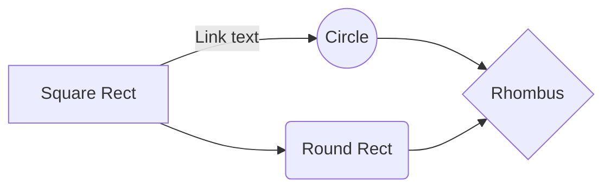

# Mini Projet Python

*Par Antonin MANSOUR et Zackary SAADA*

  

## Présentation générale

  

Ce projet est un Dashboard représentant le **montant des loyers** des appartements et maisons en **€/m2** en **fonction des communes de France** en 2022.

  

Le jeu de données est tiré du site du site **data.gouv.fr** : https://www.data.gouv.fr/fr/datasets/carte-des-loyers-indicateurs-de-loyers-dannonce-par-commune-en-2022/

Les liens utilisés pour accéder aux données du site sont statiques et ne seront donc jamais soumis aux changements.

  

## Guide utilisateur (TODO : décrire l'utilisation cf https://perso.esiee.fr/~courivad/3IPR2/depot.html ET TESTER REQUIREMENTS.TXT)

Pour déployer le Dashboard, il est préférable que **Git** soit installé sur la machine cible. Ouvrez un terminal dans le dossier où vous voulez télécharger l'application puis tapez les quatre commandes suivantes :

```bash

git clone https://git.esiee.fr/mansouan/antoninzackarypythonminiproject.git

cd antoninzackarypythonminiproject

python -m pip install -r requirements.txt
#cette ligne peut prendre un peu de temps à se terminer, veuillez bien patienter le téléchargement avant de lancer la suivante

python main.py

```

> **Note** : Télécharger le dossier directement fonctionnera également, mais il faudra l'extraire et ouvrir un terminal dedans pour y taper les commandes `python -m pip install -r requirements.txt` et `python main.py`.

  

L'application lancera un serveur local accessible à l'adresse http://127.0.0.1:8050/ contenant le Dashboard. Il est possible d'ouvrir la page en maintenant la touche **Ctrl** et en **cliquant** sur l'URL dans le Terminal.

  

Maintenir la touche **Ctrl** puis appuyer sur **C** ou **fermer la console** mettra fin au serveur.

  

## Rapport d'analyse

Nous remarquons qu'une grande partie des communes propose un loyer **maison** situé entre **6 et 9 €/m²**, avec un pic de communes entre 7 et 8 €/m².

Cette fourchette augmente pour les **appartements**, jusqu'à atteindre des fourchettes de **9 à 12€/m²** pour les T1 et T2, avec un pic de communes à 10-11€/m².

Ces informations démontrent que le prix du loyer réduit considérablement lorsque la taille du logement en m² augmente.

  

Nous remarquons également grâce à la carte que les régions où le loyer est le plus élevé sont l'**Ile de France** et la **Haute Savoie**, tandis que les loyers les moins chers sont situés dans la **[diagonale du vide](https://fr.wikipedia.org/wiki/Diagonale_du_vide)**.

  

## Guide développpeur (TODO : à terminer)

On charge tout au début comme ça on change a volonté

  

### Diagrammes

#### (mermaid)

  



*Nous déclarons sur l’honneur que l'entièreté code fourni a été produit par nous mêmes*
